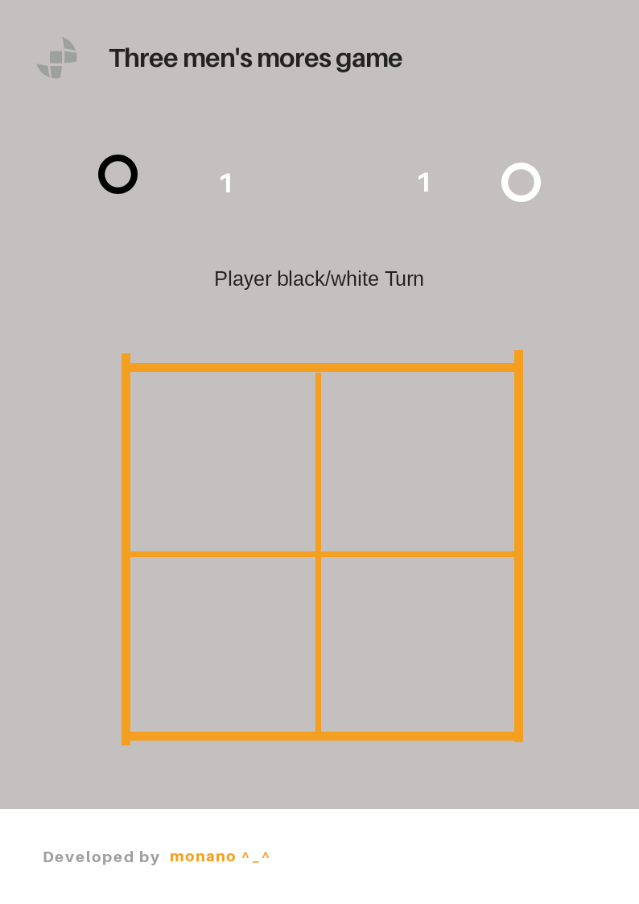

<!-- heading section -->
# Three Mens Morris Game

This is a two players game that start with each player having 3 stones to place it on the board,
The winner is the first player to align their three pieces on a vertical line or horizontal line.

<!-- unorder list -->
## Technologis Used
* Java Script
* Jquery
* HTML
* CSS

## Game Wireframe and User Stories
<!-- images -->
### Wireframe

### User Stories
1. Players start placing thier stones on the empty game board.
2. Players start moving thier stones.
3. Player who have thier stons on line win.
<!-- order list -->
<!-- 
1. JS
2. Jquery
3. Html/Css 
-->


<!-- sperator line -->
<!-- --- -->

## Snippet Of The Code
### Place Stones On Board Function
```js
const placeStones = function (e) {
    /*this function will allow players to place theirs stones on the gameboard
    and will color the circles depending on the turn of player
    and will not allow players to form mill from the start of the game*/
    
    let indexOfPoint = points.indexOf(e.currentTarget.id);
    if (blackPlayerTurn) {
        if (blackStones != 0) {
            if (takenpoints[indexOfPoint] === 0) {
                takenpoints[indexOfPoint] = 1;
                if (takenpoints[0] == 1 && takenpoints[1] == 1 && takenpoints[2] == 1 ||
                    takenpoints[3] == 1 && takenpoints[4] == 1 && takenpoints[5] == 1 ||
                    takenpoints[6] == 1 && takenpoints[7] == 1 && takenpoints[8] == 1 ||
                    takenpoints[0] == 1 && takenpoints[3] == 1 && takenpoints[6] == 1 ||
                    takenpoints[1] == 1 && takenpoints[4] == 1 && takenpoints[7] == 1 ||
                    takenpoints[2] == 1 && takenpoints[5] == 1 && takenpoints[8] == 1) {
                        Swal.fire(
                            'unallowed move',
                            'you can not place the stone here',
                            'warning'
                          )
                    takenpoints[indexOfPoint] = 0;
                } else {
                    $(e.target).removeClass("normal stonOnMove whiteStone");
                    $(e.target).addClass("blackStone");
                    blackStones--;
                    blackPlayerTurn = false;
                }
            }
        }
    } else {
        if (whiteStones != 0) {
            if (takenpoints[indexOfPoint] === 0) {
                takenpoints[indexOfPoint] = 2;
                if (takenpoints[0] == 2 && takenpoints[1] == 2 && takenpoints[2] == 2 ||
                    takenpoints[3] == 2 && takenpoints[4] == 2 && takenpoints[5] == 2 ||
                    takenpoints[6] == 2 && takenpoints[7] == 2 && takenpoints[8] == 2 ||
                    takenpoints[0] == 2 && takenpoints[3] == 2 && takenpoints[6] == 2 ||
                    takenpoints[1] == 2 && takenpoints[4] == 2 && takenpoints[7] == 2 ||
                    takenpoints[2] == 2 && takenpoints[5] == 2 && takenpoints[8] == 2) {
                        Swal.fire(
                            'unallowed move',
                            'you can not place the stone here',
                            'warning'
                          )
                    takenpoints[indexOfPoint] = 0;
                } else {
                    $(e.target).removeClass("normal stonOnMove blackStone");
                    $(e.target).addClass("whiteStone");
                    whiteStones--;
                    blackPlayerTurn = true;}}}}
    if (blackStones == 0 && whiteStones == 0) {
        endPlaceStone = true;
        return round();
    }

}
```
### Links
<!-- links -->
[Three Mens Morris game](https://en.wikipedia.org/wiki/Three_men%27s_morris)

[animate css code](https://tobiasahlin.com/moving-letters/#6)